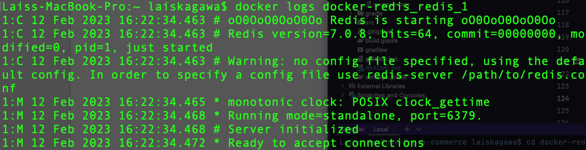

# SPORT CONNECTION - E-COMMERCE

---

# ENUNCIADO

Trata-se de um sistema de cadastro de produtos e pedidos em um portal de e-commerce. Considere
os requisitos:
- O portal possui vários produtos em estoque e com uma determinada quantidade em estoque de
cada um desses produtos.
- Cada pedido possui um ou mais produtos e um cliente associado a esse pedido.
- Um produto pode aparecer em um ou mais pedidos.
- Cada produto possui um código, um nome, uma quantidade e um valor.
- Cada cliente possui seus dados pessoais e dados de entrega.

Com base nestes requisitos:

1. Escrever o modelo do banco de dados (o famoso MER).
2. Definir as entidades necessárias.
3. Desenvolver uma aplicação, do tipo Java Project, onde todas as informações são fornecidas pelo
   usuário.
4. Utilizar o Maven ou Gradle para o gerenciamento de dependências.
5. Esse sistema deve ser desenvolvido utilizando uma das cinco combinações de técnicas:
   
   a. Spring Data JPA + Cache Redis (os dois em um único projeto). ✔
   
   b. Spring Data JPA (em um projeto separado) e Neo4J (em outro projeto separado).
   
   c. Spring Data JPA (em um projeto separado) e MongoDB (em outro projeto separado, sendo
   que neste projeto considere que pode existir um ou mais endereços de entrega
   cadastrados).
   
   d. Cassandra (em outro projeto separado, lembrando que o Cassandra não suporta
   relacionamentos, então a lógica associada a isso deverá ser implementada pela aplicação).
   
   e. Elaboração de Dockerfile ou Docker Compose referente a dois bancos de dados utilizados
   na disciplina, envolvendo o processo de clonagem de um repo até a disponibilização do
   ambiente (nesse caso basta construir um projeto básico para provar o conceito).

6. Documentar e justificar a escolha das técnicas, assim como as decisões técnicas e de arquiteturas
do sistema.

---

# OVERVIEW

<!--
- Fluxo

-->

- MER

---

# GRUPO

- RM346315: Lais Kagawa ([lakagawa](https://github.com/lakagawa))
- RM346511: Jônatha Lacerda Gonzaga ([jhowlacerda](https://github.com/jhowlacerda))
- RM346958: Thiago de Souza Zanella ([zanella86](https://github.com/zanella86))

<!--

---

# REPOSITÓRIOS RELACIONADOS
-->

---

# FERRAMENTAS / TECNOLOGIAS
- [Draw.io](https://app.diagrams.net/)
- Git / Github
- Gradle 7.6
- IntelliJ IDEA Community Edition (2022.2.1)
- Microsoft Teams
- MySQL Workbench 8.0 CE
- Redis 2.4.5
- Spring Framework 3.0.2 (Java 17+)

---

# CONSTRUÇÃO
Escolhemos a estrutura de Controller/Service/Repository. Onde a controller disponibiliza os endpoints da nossa API, na camada de SERVICE estão as regras de negócio
e no repository a consulta/inserção ao banco.
Temos alguns mappers responsáveis pela conversão do DTO para nossas ENTITIES.

# PARA TESTAR

## Bancos de dados

### MySQL

- Crie um *database schema* no MySQL chamado `my-ecommerce`

### Redis

- Execute o servidor `Redis`

- Ou utilize o docker (**necessário ter instalado o docker na máquina**)

Para subir o redis basta ir até a pasta docker-redis na raiz do projeto, nesta pasta terá um arquivo
chamado docker-compose.yml. Basta executar o comando: `docker-compose up`

Ele irá subir um container com o redis na porta padrão do redis (**6379**)

**Como validar se esta funcionando ?**

Digite o comando para lista os containers ativos: `docker container ls `

Na imagem abaixo podemos identificar o nosso container do redis rodando com
o nome **docker-redis_redis_1**

Feito isso é possível conectar no nosso container e ver os logs do redis,
execute o seguinte comando: `docker logs <nome_container> `

EX: `docker logs docker-redis_redis_1`

E por fim, vamos conectar no container. 

Utilize este comando: `docker exec -it <nome_container> sh`

EX: `docker exec -it docker-redis_redis_1 sh`

Se o cursor estiver piscando, quer dizer que você ta conectado, porém para executar os comandos
do redis, precisamos executar mais um comando: `redis-cli`

E pronto, you're good to go!

### Postman
Na pasta docs na raiz do projeto tem uma collection configurada com as principais chamadas do nosso sistema
e-commerce.postman_collection.json

### Swagger
Implementamos a documentação do swagger que esta disponível no seguinte endpoint:
http://localhost:8080/e-commerce/swagger-ui/index.html#/

---

# REFERÊNCIAS

- [FIAP (Profº Rafael Matsuyama)](https://github.com/rafaelmatsuyama/FIAP-2022-SCJ-JavaPersistence)
- [Emojis](https://github.com/markdown-templates/markdown-emojis)
- [Simbologia - Cardinalidade](https://cadernodeprova.com.br/notacao-pe-de-galinha-cardinalidade/)
- [Substituição do pacote javax por jakarta](https://stackoverflow.com/questions/60021815/why-has-javax-persistence-api-been-replaced-by-jakarta-persistence-api-in-spring)
- [Usar jakarta.persistence ou org.springframework.data?](https://stackoverflow.com/questions/39643960/whats-the-difference-between-javax-persistence-id-and-org-springframework-data)
- [Testando via Spring MockMvc](https://spring.io/guides/gs/testing-web/)
- [Jackson - ObjectMapper Tutorial](https://www.baeldung.com/jackson-object-mapper-tutorial)
- [DTO - Usar ou não Serializable?](https://stackoverflow.com/questions/71826801/should-i-use-serializable-for-my-dto-and-why-should-i-use)
- [JPA - Entities Serializable](https://www.baeldung.com/jpa-entities-serializable)
- [HTTP Methods: Put vs Patch](https://medium.com/@gabrielrufino.js/put-vs-patch-pare-de-agora-escolher-errado-533b8c6058d9)
- [Como usar Optional em java](https://www.developer.com/java/java-optional-object/)
- [Java LocalDate](https://docs.oracle.com/en/java/javase/17/docs/api/java.base/java/time/LocalDate.html)
- [Java 8 - LocalDate: Jackson Module jsr310](https://stackoverflow.com/questions/21384820/is-there-a-jackson-datatype-module-for-jdk8-java-time) / [Customizing Jackson mapper](https://www.baeldung.com/spring-boot-customize-jackson-objectmapper)
- [Hibernate Date Tyes](https://www.baeldung.com/hibernate-date-time)
- [Jackson ObjectMapper - Customize](https://www.baeldung.com/spring-boot-customize-jackson-objectmapper)
- [Jackson-modules-java8 repository](https://github.com/FasterXML/jackson-modules-java8)
- [Redis Commands](https://redis.io/commands/)